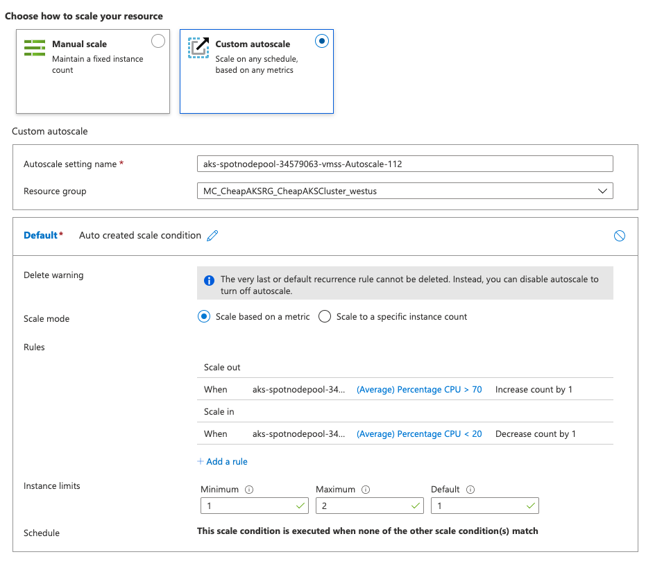

# How to Run The Cheapest Kubernetes Cluster at $1 Per Day (Tutorial)

## Preamble

[In Part 1](https://georgepaw.medium.com/how-to-run-the-cheapest-kubernetes-cluster-at-1-per-day-9287abb90cee) we went through the theory and price comparisons between all major cloud providers and how we achieve the magical number of $1 per day to run a fully managed Kubernetes Cluster, which powers my new app [Fakes.io](https://fakes.io).

The following is a tutorial on how to create your very own cheapest managed Kubernetes cluster.

## Assumptions

I am assuming that you have basic knowledge of Azure. If you are new to Azure, feel free to have a look at the [Azure Fundamentals Course here](https://docs.microsoft.com/en-us/learn/certifications/azure-fundamentals).

You need to have an Azure account. You can [sign up here](https://azure.microsoft.com/en-us/free/) if you don't.

You need to create a separate Pay-As-You-Go subscription in Azure. The Free Tier offering does not allow you to create a Spot Node Pool (took me days to figure this one out).

I am using docker-desktop to run my container. You can [download it from here](https://www.docker.com/products/docker-desktop).

](images/001-webapp.png)

## Tutorial

We start by pulling down and running the azure-cli container. Install AKS CLI and AKS-PREVIEW to allow spot nodepool creation.

```bash
# Create a project directory
git clone git@github.com:gpaw/Cheap_AKS_Kubernetes_Cluster.git
cd Cheap_AKS_Kubernetes_Cluster.git
docker run -ti --rm --name azure-cli-tutorial -v ~/Cheap_AKS_Kubernetes_Cluster:/home -w /home mcr.microsoft.com/azure-cli

# Install AKS CLI
az aks install-cli

# install extension to allow spot node creation
az extension add --name aks-preview
```

Set the global variables. You must use your Pay-As-You-Go subscription and not your Free Tier subscription (converting it does not work, you need a completely separate subscription). And create a SSH key pair too.

```bash
# Set Global Variables
export SUBSCRIPTION=INSERT_YOUR_PAY_AS_YOU_GO_SUBSCRIPTION_ID
export LOCATION=westus
export RESOURCE_GROUP=CheapAKSRG
export AKS_CLUSTER=CheapAKSCluster
export MC_RESOURCE_GROUP=MC_${RESOURCE_GROUP}_${AKS_CLUSTER}_${LOCATION}
export SPOT_VMSS=spotnodepool
export VM_SIZE=Standard_A2_v2

# Create SSH key pair to login to instance in the future
ssh-keygen -t rsa -b 4096 -C "CheapAKSCluster"
# Enter filename: ./cheapakscluster
# No passphrase
```

You need to authorise container services in your Azure subscription. You only need to do this once.

```bash
# Authorise Container Services  (Only Have to Run Once)
az feature register \
	--subscription $SUBSCRIPTION \
	--namespace "Microsoft.ContainerService" \
    --name "spotpoolpreview"
    
az feature list -o table \
	--subscription $SUBSCRIPTION \
	--query "[?contains(name, 'Microsoft.ContainerService/spotpoolpreview')].{Name:name,State:properties.state}"

az provider register \
	--subscription $SUBSCRIPTION \
```

Run the following commands to login, create your resource group and AKS cluster. The very first default node pool of your AKS cluster uses on-demand virtual machine. We will turn this off later.

```bash
# Login for the first time
az login

# Set your default subscription
az account set --subscription $SUBSCRIPTION

# Create a resource group in region
az group create --name $RESOURCE_GROUP \
		--subscription $SUBSCRIPTION \
		--location $LOCATION 

# Create a basic single-node AKS cluster
az aks create \
	--subscription $SUBSCRIPTION \
    --resource-group $RESOURCE_GROUP  \
    --name $AKS_CLUSTER \
    --vm-set-type VirtualMachineScaleSets \
    --node-count 1 \
    --ssh-key-value cheapakscluster.pub\
    --load-balancer-sku standard \
    --enable-cluster-autoscaler \
    --min-count 1 \
    --max-count 3
    
# Make note of where service principal is
ls -lstr $HOME/.azure/aksServicePrincipal.json

# Get AKS Credentials
az aks get-credentials \
	--subscription $SUBSCRIPTION \
	--resource-group $RESOURCE_GROUP \
    --name $AKS_CLUSTER
```


We will create the spot node pool by running the following commands. Once the node is running, we need to remove the taints to allow the core-dns services to run on a spot node.

```bash
# Add Spot Nodepool - Only works for Pay-As-You-Go - wait 3 mins
az aks nodepool add \
	--subscription $SUBSCRIPTION \
    --resource-group $RESOURCE_GROUP \
    --cluster-name $AKS_CLUSTER \
    --name $SPOT_VMSS \
    --priority Spot \
    --spot-max-price -1 \
    --eviction-policy Delete \
    --node-vm-size $VM_SIZE \
    --node-count 1 \
    --node-osdisk-size 32 \
    --enable-cluster-autoscaler \
    --min-count 1 \
    --max-count 3

# Confirm that the spot nodepool has started
kubectl get node

# only to allow coredns pods to run on the first node
kubectl taint nodes --all kubernetes.azure.com/scalesetpriority-

# bash-5.0# kubectl get node
# NAME                                   STATUS   ROLES   AGE     VERSION
# aks-nodepool1-34579063-vmss000000      Ready    agent   12m     v1.18.10
# aks-spotnodepool-34579063-vmss000000   Ready    agent   2m39s   v1.18.10

# bash-5.0# kubectl taint nodes --all kubernetes.azure.com/scalesetpriority-
# node/aks-spotnodepool-34579063-vmss000000 untainted
# error: taint "kubernetes.azure.com/scalesetpriority" not found
```


Next, we will scale down the default node pool to 0 instance.

Why can't we delete it? [Because Azure said so.](https://docs.microsoft.com/en-us/azure/aks/spot-node-pool)

>A spot node pool can't be the cluster's default node pool. A spot node pool can only be used for a secondary pool.

But the default node pool using on-demand is too expensive. Therefore we effectively neutered it by scaling down to 0 instance.

>There is a bug where the default node pool will suddenly spin up a new instance. Please always double check.

```bash
# Get VMSS name - sometimes it doesn't work, gives []
export NODE_VMSS=$(az vmss list \
    --resource-group $MC_RESOURCE_GROUP \
    --subscription $SUBSCRIPTION \
    --query '[0].name' -otsv)
    
# make sure it is nodepool1
echo $NODE_VMSS
# aks-nodepool1-34579063-vmss

# Reduce VMSS to 0 nodes
az vmss scale \
	--subscription $SUBSCRIPTION \
	--resource-group $MC_RESOURCE_GROUP \
	--name $NODE_VMSS \
	--new-capacity 0

# Check if default node is still running
watch kubectl get node

# Delete node if it is still lingering
kubectl delete node INSERT_DEFAULT_NODEPOOL_NAME

# bash-5.0# kubectl get node
# NAME                                   STATUS   ROLES   AGE   VERSION
# aks-spotnodepool-34579063-vmss000000   Ready    agent   24m   v1.18.10
```


Now we wait until all containers shut down in the default node and all the containers started running in the spot node. Run the Kubernetes deployment manifest to start the application pods.

```bash
# make sure all core-dns pods are running in spot node
# may take a while
# BUG: sometimes it will trigger the full price nodepool to scale up again, always double check
watch kubectl get pod -A -o wide

## RUN KUBERNETES COMMANDS
kubectl apply -f azure-vote-back-deployment.yaml

# check deployment
watch kubectl get pod -o wide
```


Give your Public IP address a DNS name, you should be able to reach it at `http://ENTER-YOUR-DNS-NAME.westus.cloudapp.azure.com/`

```bash
# Add DNS to Kubernetes Public IP Address 
export K8S_IP_ID=$(az network public-ip list \
	--subscription $SUBSCRIPTION \
	--resource-group $MC_RESOURCE_GROUP \
    --query '[1].id' -otsv)
az network public-ip update \
	--ids $K8S_IP_ID \
	--dns-name ENTER-YOUR-DNS-NAME
```


## Scaling (Optional)

Set customer autoscale to CPU usage criteria

- Increase compute instance count by 1 if average percentage CPU is more than 70% for more than 10 minutes
- Decrease compute instance count by 1 if average percentage CPU is less than 20% for more than 10 minutes



Once you are done, you can tear everything down.

```bash
# Delete AKS Cluster
az group delete \
	--subscription $SUBSCRIPTION \
   	--name $RESOURCE_GROUP \
    	--yes --no-wait
```
